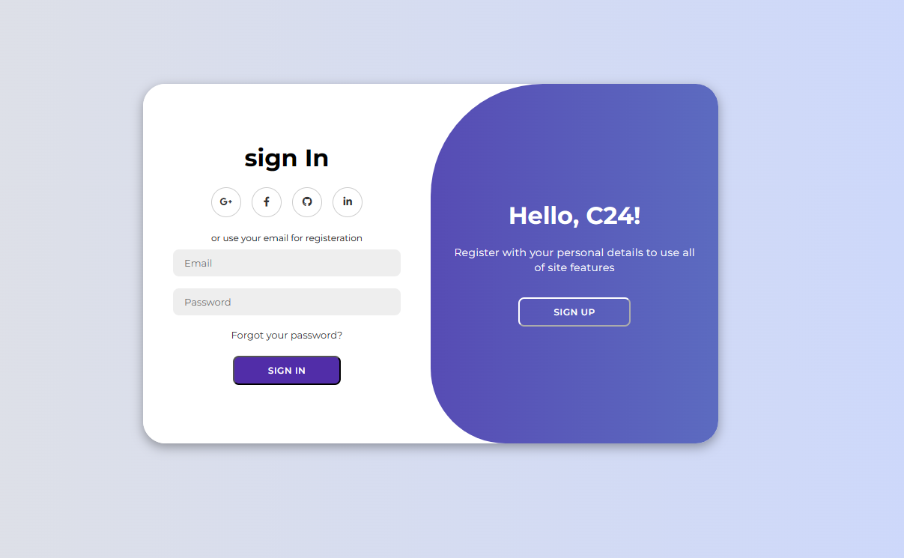

# Login Page

This repository contains code for a modern login page designed using HTML, CSS, and JavaScript.



**Author: Mandara Michel**  
**Contact: Mandarahades@gmail.com**

## Table of Contents

- [Features](#features)
- [Overview](#overview)
- [File Structure](#file-structure)
- [Usage](#usage)
- [Contributing](#contributing)

## Overview

The login page consists of a form allowing users to sign up or sign in using their email and password. It also provides social login options via Google, Facebook, GitHub, and LinkedIn.

## Features

- **Sign Up Form**: Users can create an account by entering their name, email, and password.
- **Sign In Form**: Existing users can sign in using their registered email and password.
- **Social Login**: Integration with social media platforms for easier access.
- **Toggle Functionality**: Easily switch between sign-up and sign-in forms.

## File Structure

- `index.html`: Contains the HTML structure of the login page.
- `style.css`: Includes styles for the login page layout and design.
- `script.js`: Manages the toggle functionality for switching between sign-up and sign-in forms.

## Usage

To run the login page:

1. Clone the repository to your local machine:

   ```bash
   git clone https://github.com/Mandarahades/Pro-Login-Page.git
