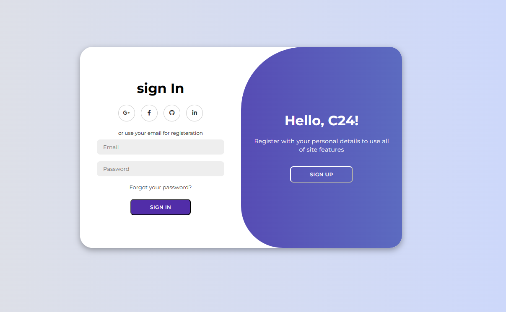

**Author: Mandara Michel**  
**Contact: Mandarahades@gmail.com**

# Login Page

This repository contains code for a moderne login page designed using HTML, CSS, and JavaScript.

## Table of contents

-[Features](#features)
-[Overview](#overview)
-[File Structure](#file-structure)
-[Usage](#usage)
-[Contributing](#contributing)

## Overview

The login page consists of a form allowing users to sign up or sign in using their email and password. It also provides social login options via Google, Facebook, GitHub, and LinkedIn.

## Features

- **Sign Up Form**: Users can create an account by entering their name, email, and password.
- **Sign In Form**: Existing users can sign in using their registered email and password.
- **Social Login**: Integration with social media platforms for easier access.
- **Toggle Functionality**: Easily switch between sign-up and sign-in forms.

## File Structure

- `index.html`: Contains the HTML structure of the login page.
- `style.css`: Includes styles for the login page layout and design.
- `script.js`: Manages the toggle functionality for switching between sign-up and sign-in forms.

## Usage

To run the login page:

1. Clone the repository to your local machine.
1. Clone the repository:

   ```bash
   git clone https://github.com/Mandarahades/A-beautiful-Pixel-Art-Generator.git
   ```

2. Open `index.html` in a web browser.

## Contributing

Contributions are welcome! If you find any bugs or have suggestions for improvements, feel free to create issues or submit pull requests.
## Contributing

If you would like to contribute to this project, please follow the guidelines in [CONTRIBUTING.md](CONTRIBUTING.md).


